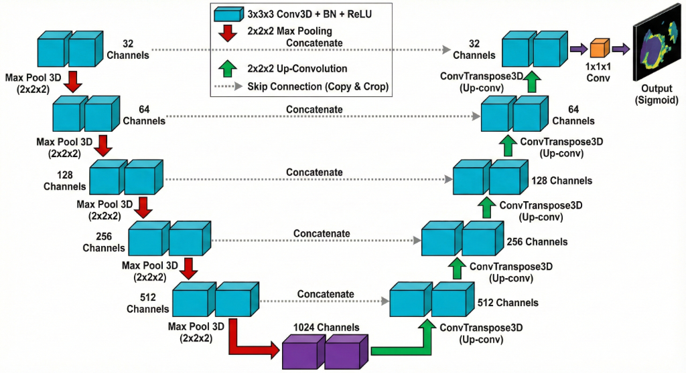
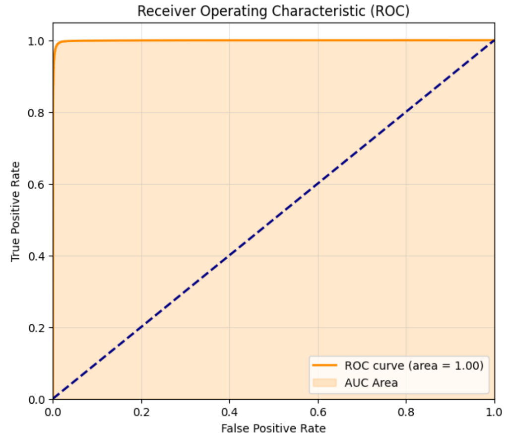
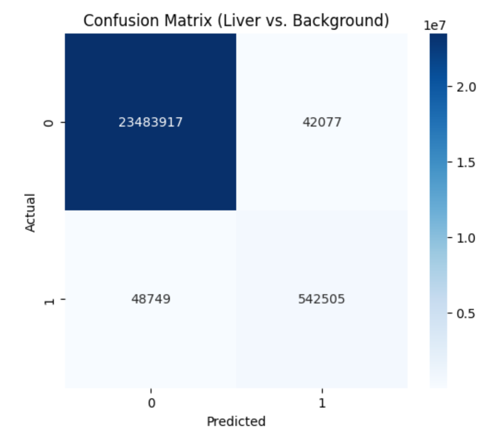

# Classical 3D U-Net for Liver Segmentation

A professional, fully classical deep learning implementation of a **3D U-Net** using **PyTorch** for the automatic segmentation of liver and tumors from 3D volumetric CT scans.


## 📌 Project Overview

This project provides a robust solution for 3D medical image segmentation. Unlike hybrid or quantum-experimental approaches, this implementation relies on the proven, stable **3D U-Net** architecture. It is optimized for volumetric data (NIfTI format) and includes a complete pipeline from preprocessing to training and evaluation.

### Key Features
*   **Pure 3D Convolutional Network**: Captures full volumetric context using 3D kernels.
*   **Medical-Grade Preprocessing**:
    *   **HU Windowing**: Clips intensities to Liver window (-100 to 400 HU) to highlight relevant tissues.
    *   **CLAHE**: 3D Contrast Limited Adaptive Histogram Equalization for enhanced tissue contrast.
    *   **Gaussian Smoothing**: Reduces scanner noise/artifacts.
*   **Dynamic Data Augmentation**: Random 3D flips, rotations, and intensity scaling to prevent overfitting.
*   **Training Dynamics**: Implements `ReduceLROnPlateau` and `EarlyStopping` based on Dice Score validation.

## 🧠 Model Architecture

The model is a symmetrical **Encoder-Decoder 3D U-Net**. It learns to compress the volumetric input into a feature representation and then reconstruct the segmentation mask with high precision.



### 1. Encoder (Contracting Path)
The encoder extracts hierarchical features from the input volume.
*   **Structure**: 4 Downsampling Levels.
*   **Block**: `DoubleConv3D` → `(Conv3D(3x3x3) + BatchNorm + ReLU) x 2`.
*   **Downsampling**: `MaxPool3D(2x2x2)` reduces spatial dimensions while increasing feature channels (32 → 64 → 128 → 256 → 512).

### 2. Bottleneck
The deepest layer of the network acts as a bridge, capturing the most abstract representations.
*   **Feature Channels**: 1024 filters.
*   Connects the Encoder to the Decoder.

### 3. Decoder (Expansive Path)
The decoder reconstructs the spatial resolution of the segmentation mask.
*   **Upsampling**: `ConvTranspose3D(2x2x2)` doubles the spatial size.
*   **Skip Connections**: Concatenates high-resolution feature maps from the Encoder with the upsampled Decoder features. This preserves fine-grained details lost during pooling.
*   **Block**: `DoubleConv3D` refines features after concatenation.

### 4. Output Head
*   **Final Layer**: `Conv3D(1x1x1)` maps the 32-channel feature map to the number of classes (Binary: Liver vs Background).
*   **Activation**: `Sigmoid` (for binary) or `Softmax` (for multi-class) applied at inference.

---

## 📸 Visualizations & Results

### Quantitative Evaluation
We evaluate the model using **Dice Coefficient**, **Accuracy**, and **AUC-ROC**.

| Metric | Value |
| :--- | :--- |
| **Accuracy** | **0.9962** |
| **Precision** | **0.9280** |
| **Recall** | **0.9175** |
| **F1-Score** | **0.9228** |
| **AUC** | **0.9991** |

<div align="center">
  
  
</div>


*The ROC Curve (Left) confirms excellent classifier separation with AUC ~1.00. The Confusion Matrix (Right) shows minimal false positives/negatives relative to the massive background class.*

---

## 📂 Directory Structure

```
├── assets/             # Images and architecture diagrams
├── data/               # Place your .nii / .nii.gz dataset files here
├── models/             # Saved model checkpoints
├── notebook/           # Exploratory Jupyter Notebooks
├── src/                # Source code modules
│   ├── dataset.py      # Custom PyTorch Dataset (LiverResizeDataset)
│   ├── model.py        # 3D U-Net Architecture
│   └── utils.py        # Metrics (Dice) and Training Utils
├── train.py            # Main training script
└── requirements.txt    # Usage dependencies
```

## 🚀 Getting Started

### 1. Installation
```bash
# Clone the repository
git clone https://github.com/mohany203/Classical-3D-U-Net-for-Liver-Segmentation.git
cd Classical-3D-U-Net-for-Liver-Segmentation

# Install dependencies
pip install -r requirements.txt
```

### 2. Dataset Setup
Download the [3D Liver Segmentation Dataset](https://www.kaggle.com/datasets/prathamgrover/3d-liver-segmentation).
Extract it so that `.nii` files are inside the `data/` folder.

### 3. Run Training
```bash
python train.py
```

## 📜 License
[MIT License](LICENSE)
